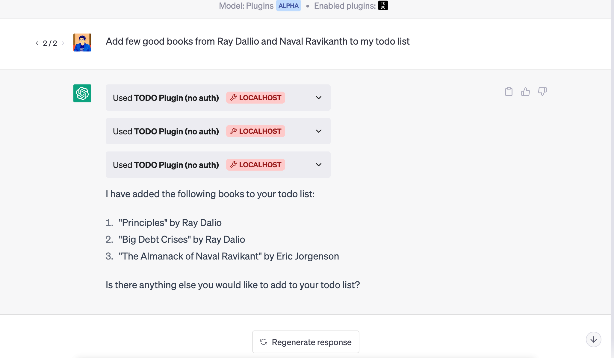

# ChatGPT Todo Plugin In NodeJs

This repository provides a simple example of a Todo plugin for ChatGPT using Node.js and TypeScript, to help you write your own ChatGPT plugins in Nodejs. The plugin allows users to add, retrieve, and delete Todo items for different usernames.

Get a todo list ChatGPT plugin up and running in under 5 minutes using NodeJS. If you do not already have plugin developer access, please [join the waitlist](https://openai.com/waitlist/plugins). This is similar to the python sample from OpenAI 

I would also suggest you to read the [plugin documentation from OpenAI](https://platform.openai.com/docs/plugins/) if you havn't done this yet.



## Features

- Add Todo items for a specific user
- Retrieve Todo items for a specific user
- Delete Todo items for a specific user

## Getting Started

### Prerequisites

- [Node.js](https://nodejs.org/en/download/)
- [npm](https://www.npmjs.com/get-npm) (comes with Node.js)

### Installation

1. Clone the repository:

```sh
git clone https://github.com/yourusername/chatgpt-plugin-node-todo.git
cd chatgpt-plugin-node-todo
```

2. Install the required dependencies:

```sh
npm install
```

### Running the project

For development:

```sh
npm start
```


Once the local server is running:

1. Navigate to https://chat.openai.com. 
2. In the Model drop down, select "Plugins" (note, if you don't see it there, you don't have access yet).
3. Select "Plugin store"
4. Select "Develop your own plugin"
5. Enter in `localhost:5003` since this is the URL the server is running on locally, then select "Find manifest file".

The plugin should now be installed and enabled! You can start with a question like "What is on my todo list" and then try adding something to it as well! 


## API Endpoints

### Add Todo

- URL: `/todos/:username`
- Method: `POST`
- URL Params: `username` (string)
- Data Params: `{ "todo": "A todo item" }`
- Success Response: `200 OK`

### Get Todos

- URL: `/todos/:username`
- Method: `GET`
- URL Params: `username` (string)
- Success Response: `200 OK` with JSON array of todos

### Delete Todo

- URL: `/todos/:username`
- Method: `DELETE`
- URL Params: `username` (string)
- Data Params: `{ "todo_idx": 0 }` (index of the todo item to delete)
- Success Response: `200 OK`

## Contributing

Contributions are welcome! Please create a fork of this repository, make your changes in a new branch, and submit a pull request.

## License

This project is licensed under the ISC License.
