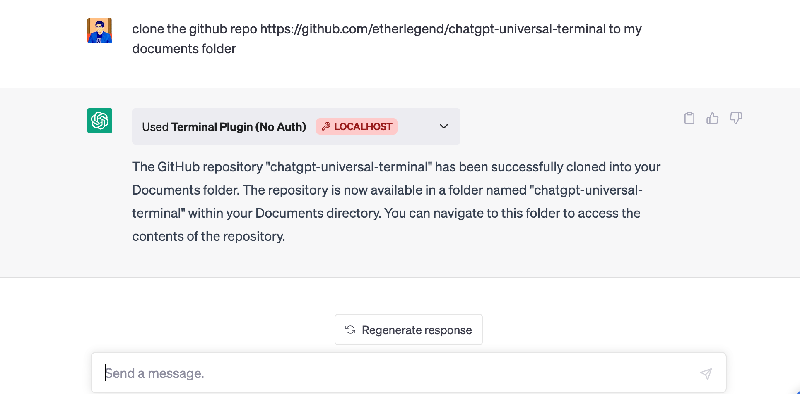
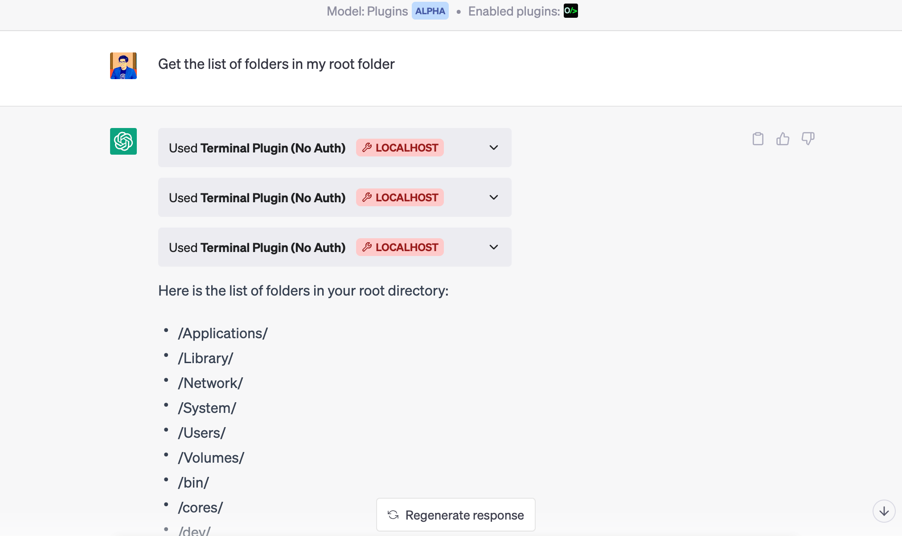
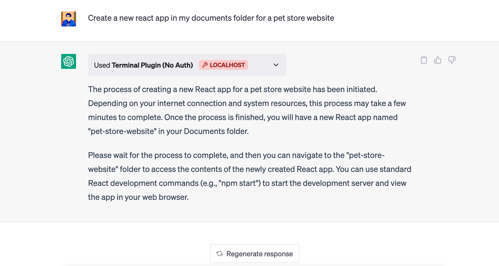
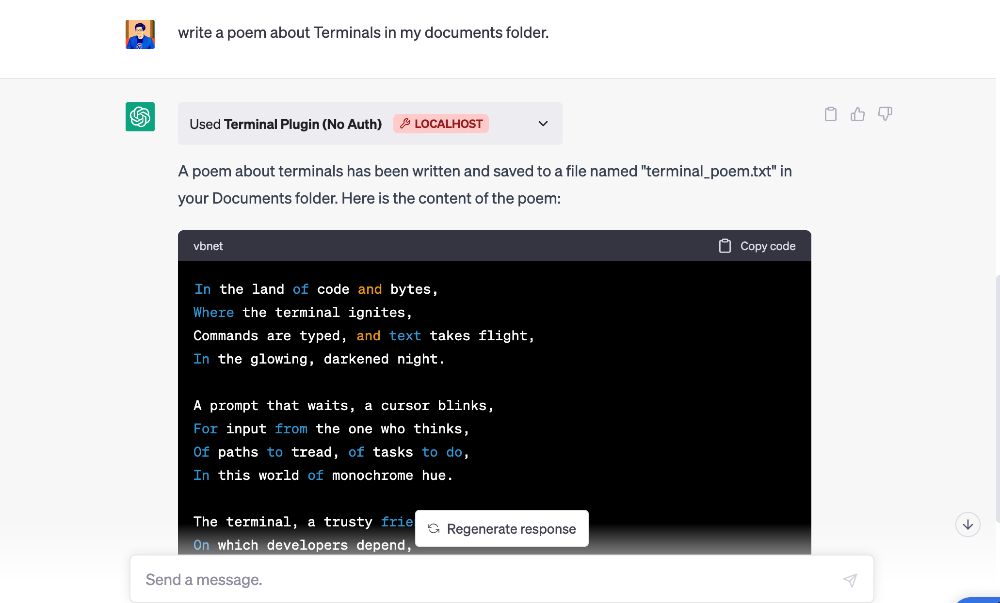

# ChatGPT Universal Terminal / Command Line

This is a universal terminal/command line plugin that'll let you use ChatGPT as a terminal using natural language. The plugin allows you to accomplish goals by running terminal commands, including reading & writing files, establishing cool workflows, etc. The possibilities are crazy.

You need ChatGPT plugin/developer access to try this. If you do not already have plugin developer access, please [join the waitlist](https://openai.com/waitlist/plugins).

You can read the [plugin documentation from OpenAI](https://platform.openai.com/docs/plugins/).

If you are looking for a boilerplate to build plugins in NodeJs, try my ChatGPT NodeJS boilerplate [here](https://github.com/etherlegend/chatgpt-universal-terminal). 

The plugin can modify files in your file system, so use this responsibly :)

## What you can do with it

Pretty much anything, and more!! 

#### Clone Github Repos



#### List or write files & folders


#### Create projects and websites


#### Do almost all text tasks between files


Try translating content between files, summarising text etc etc..

## Getting Started

1. Clone the repository

```
git clone https://github.com/yourusername/chatgpt-universal-terminal.git
```

2. Navigate to the project directory

```
cd chatgpt-universal-terminal
```

3. Install the required dependencies

```
npm install
```

4. Start the server

```
npm start
```

The server will now be running on `http://localhost:5004`.


Once the local server is running:

1. Navigate to https://chat.openai.com.
2. In the Model drop down, select "Plugins" (note, if you do not see it there, you do not have access yet).
3. Select "Plugin store"
4. Select "Develop your own plugin"
5. Enter in localhost:5004 since this is the URL the server is running on locally, then select "Find manifest file".

The plugin should now be installed and enabled! You can start with a question like "What is on my todo list" and then try adding something to it as well!


## Usage

To use this plugin in ChatGPT, configure your ChatGPT plugin settings to point to the running server.

### Endpoints

- `GET /system/os-version`: Returns the OS version
- `GET /system/local-time`: Returns the local time
- `GET /system/current-folder`: Returns the current folder
- `POST /system/command`: Runs a command and returns the output

## License

This project is licensed under the MIT License - see the [LICENSE](LICENSE) file for details.

